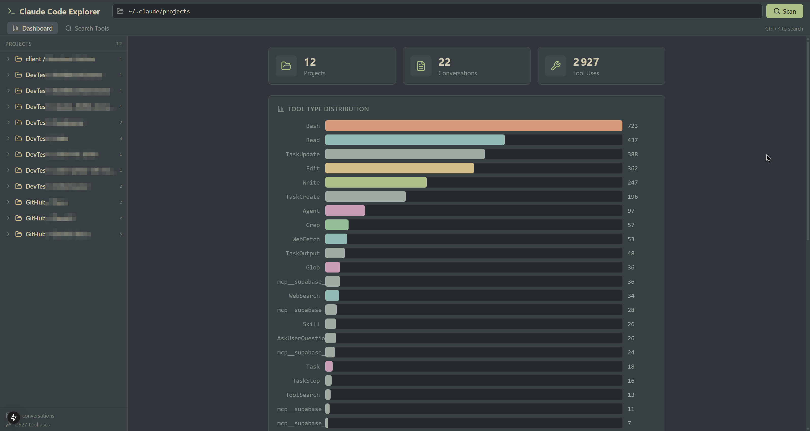

# Claude Code Explorer

A powerful local web app to browse, search, and analyze your Claude Code CLI conversation history. Point it to your `~/.claude/projects/` directory and instantly explore all your conversations, tool uses, and development sessions.



## Features

### Directory Scanner
- Automatically scans `~/.claude/projects/` on launch
- Discovers all projects and conversation sessions
- Shows project tree with clean names grouped by category (DevTest, GitHub, client...)

### Conversation Browser
- Full message timeline with user/assistant messages
- Expandable tool use cards with syntax highlighting
- Color-coded tool types (Edit, Write, Bash, Read, Grep, Glob, Agent...)
- Tool results displayed inline, collapsible
- Session metadata: git branch, working directory, timestamps

### Tool Use Search
- **Search across ALL conversations** for any tool use
- Filter by tool type with toggleable pills
- Find specific file modifications, bash commands, grep patterns, etc.
- Results show context, timestamps, and project info
- Click to expand details or jump directly into the conversation

### Dashboard
- Stats overview: projects, conversations, total tool uses
- Tool type distribution chart
- Quick navigation to any project

### Keyboard Shortcuts
- `Ctrl+K` — Focus search
- `Escape` — Go back / collapse expanded items

## Quick Start

```bash
git clone https://github.com/withLinda/claude-JSONL-browser.git
cd claude-JSONL-browser
npm install
npm run dev
```

Open http://localhost:3000 — the app auto-scans your `~/.claude/projects/` directory.

## Use Cases

- **"What SSH commands did I run last week?"** — Search `ssh` with Bash filter
- **"Which files did Claude edit in my Lidar project?"** — Browse the project, check Edit/Write tool uses
- **"Find that npm install command from 3 days ago"** — Search `npm install`
- **Review a past conversation** — Click any session in the sidebar to replay the full exchange
- **Audit tool usage** — Dashboard shows distribution of all tool types across your history

## Architecture

```
app/
  api/
    scan/route.ts          # Scans directory for JSONL conversation files
    conversation/route.ts  # Parses and returns a single conversation
    search/route.ts        # Full-text search across all tool uses
  page.tsx                 # Entry point
  layout.tsx               # Root layout with Everforest theme

components/
  ConversationBrowser.tsx  # Main UI (dashboard, conversation view, search)

lib/
  types.ts                 # TypeScript interfaces
  parser.ts                # JSONL parsing and tool use extraction
  utils.ts                 # Formatting utilities
```

## Tech Stack

- **Next.js 15** with App Router and API routes
- **TypeScript** with strict mode
- **Tailwind CSS** with Everforest dark theme
- **Lucide React** for icons
- 100% local — no data leaves your machine

## JSONL Format

Claude Code CLI stores conversations as JSONL files in `~/.claude/projects/{project-path}/`. Each line is a JSON object representing a message, tool use, or system event. This app parses the following message types:

| Type | Content |
|------|---------|
| `user` | Your messages and tool results |
| `assistant` | Claude's responses and tool use requests |
| `summary` | Auto-generated session summaries |

Tool uses (Edit, Write, Bash, Read, Grep, Glob, Agent, WebSearch, etc.) are extracted from assistant messages with their full input parameters for searchable browsing.

---

Created by [Linda](https://withlinda.dev) for the Claude Code community.
